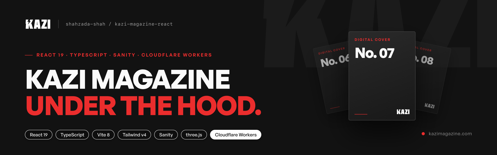
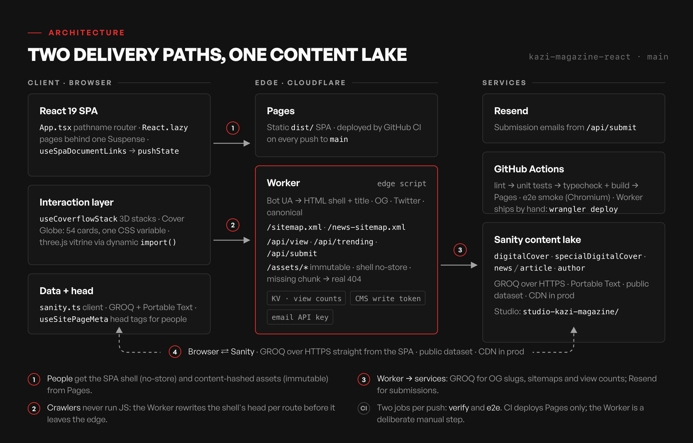

  

  

<!-- Repo: shahzada-shah/kazi-magazine-platform · see docs/readme/REPO_SETUP.md for name, description, topics, settings -->

# Kazi Magazine

The editorial platform behind [kazimagazine.com](https://kazimagazine.com): a React 19 + TypeScript single-page magazine with a Sanity content lake, 3D cover experiences, and a Cloudflare Worker that serves crawlers, sitemaps and view analytics at the edge.

**Live:** [kazimagazine.com](https://kazimagazine.com) · **Role:** sole engineer, design to deploy · **Author:** [Shahzada Shah](https://shahzada.dev)

> This is a showcase. The production codebase is private; this repository documents the architecture, the engineering decisions and the results. Happy to walk through the code in an interview.

## Demo

<!-- Record both at 1440×900, ≤ 8 s each, export as GIF or MP4→GIF at 896px wide. -->
<table>
  <tr>
    <td width="50%"></td>
    <td width="50%"></td>
  </tr>
  <tr>
    <td align="center">Homepage hero + featured coverflow</td>
    <td align="center">Cover Globe on <code>/digital-covers</code></td>
  </tr>
</table>

## At a glance

| Number | What it is |
|:--|:--|
| **14 routes** | one hand-rolled pathname router: `pushState`, scroll restoration, zero router dependencies |
| **104 kB gzip** | entry chunk after route-level code splitting, down 20 % with zero build warnings |
| **184 kB gzip** | the three.js chunk, downloaded only when the 3D case scrolls within 200 px of the viewport |
| **2 delivery paths** | Cloudflare Pages for people, a Cloudflare Worker for crawlers, sitemaps and APIs |

## Tech stack

| Layer | Choices |
|:--|:--|
| UI | React 19, TypeScript 6, Vite 8, Tailwind CSS v4 (`@theme` design tokens) |
| Content | Sanity (GROQ, Portable Text) with a Sanity Studio for editors |
| Motion & 3D | three.js (dynamic import), Lottie preloader, CSS 3D coverflow |
| Edge | Cloudflare Pages + Workers, Workers KV, Resend |
| Quality | ESLint 9, Vitest 4, Playwright, GitHub Actions |

## Architecture

1. **People** load the SPA shell from Cloudflare Pages (`no-store`) and content-hashed assets (`immutable`), then query Sanity directly over GROQ.
2. **Crawlers** hit the Worker, which fetches the shell and injects title, description, Open Graph, Twitter card and canonical tags per route. Article slugs resolve through one GROQ `coalesce` query.
3. The same Worker owns `/sitemap.xml`, `/news-sitemap.xml`, `/api/view`, `/api/trending` and `/api/submit`.

## Key engineering decisions

### 1. Route-level code splitting, with barrel hygiene
Eleven page components load through `React.lazy` behind a single `Suspense` boundary. Page-only exports were pulled out of barrel files so Vite never gets a static edge back into the entry chunk. When three cover pages drifted back into a barrel, the build printed `INEFFECTIVE_DYNAMIC_IMPORT` and the entry grew to 456 kB; removing them brought it to 340.87 kB (104.07 kB gzip) with zero warnings. The warning count is the regression alarm.

### 2. A crawler-aware edge
People get the SPA; bots never run JavaScript. The edge Worker matches the user agent, fetches `index.html`, strips the default meta and injects route-specific title, OG, Twitter and canonical tags. It also renders the sitemap and Google News sitemap from Sanity and exposes `/api/view` (KV counters mirrored to Sanity `viewCount`), `/api/trending` (KV sort, 5-minute CDN cache) and `/api/submit` (Resend email).

### 3. 54 covers, one CSS variable
The Cover Globe places 54 covers on a Fibonacci lattice across three shell radii, so coplanar cards never z-fight inside `preserve-3d`. Drag speed feeds one `--kz-burst` custom property on the sphere; a 32 ms interval writes two properties on one element, decays per elapsed time and parks when off-screen. Cards mount only after the first `IntersectionObserver` hit: 0 images on load, 54 after scroll.

### 4. three.js never touches the entry chunk
The Bubbling collector case imports `three` and `OrbitControls` dynamically once the section is 200 px from the viewport. Geometry builders are plain ES modules that receive the `THREE` namespace as an argument, so no static edge exists. Pixel ratio is capped at 2, the render loop suspends on `visibilitychange`, and teardown disposes every geometry and material. `enableZoom` is off on purpose: the wheel belongs to the page.

### 5. Deploys that cannot strand a client
Hashed `/assets/*` are cached `immutable`; the shell is `no-store`. After a deploy, a missing chunk returns a real 404 instead of HTML, so the lazy loader reloads once rather than throwing a MIME error. The first-visit preloader holds at 86 % until the DOM and above-the-fold Sanity content are ready, with a 4.5 s hard timeout.

## Quality & delivery

- **Unit tests** (Vitest, Node environment) cover the pure helpers: coverflow math, embed URL normalization, header dock state, the pressing study. Six suites.
- **End-to-end smoke** (Playwright, Chromium) runs against the production build: shell renders, 404 page, back-home routing.
- **CI** (GitHub Actions) runs two jobs on every push and pull request: **verify** (lint → unit tests → typecheck + build) and **e2e**. Superseded runs are cancelled.
- **Two deploy paths**, on purpose: Pages ships automatically from `main`; the Worker ships by hand so edge changes are always a deliberate step.
- **Accessibility**: semantic landmarks, ARIA on interactive chrome, visible focus rings, ⌘K search, `prefers-reduced-motion` honoured on every animation.

## Roadmap

- [ ] WebP for the remaining large PNGs (category pills, footer wordmark), 60–70 % smaller
- [ ] `srcset` on hero and article images via Sanity's URL builder
- [ ] Single GROQ union for legacy `news` / `article` lookups, in the Worker and the client
- [ ] `fetchPriority="high"` on above-the-fold coverflow images
- [ ] Mount `/bubbling` and `/ysl-x-kazi` (components exist, routes not wired)
- [ ] Article loading state: skeleton or top progress bar
- [ ] Virtualize hub grids past ~20 items

## Author

**Shahzada Shah** · Full-stack engineer
[GitHub](https://github.com/shahzada-shah)
